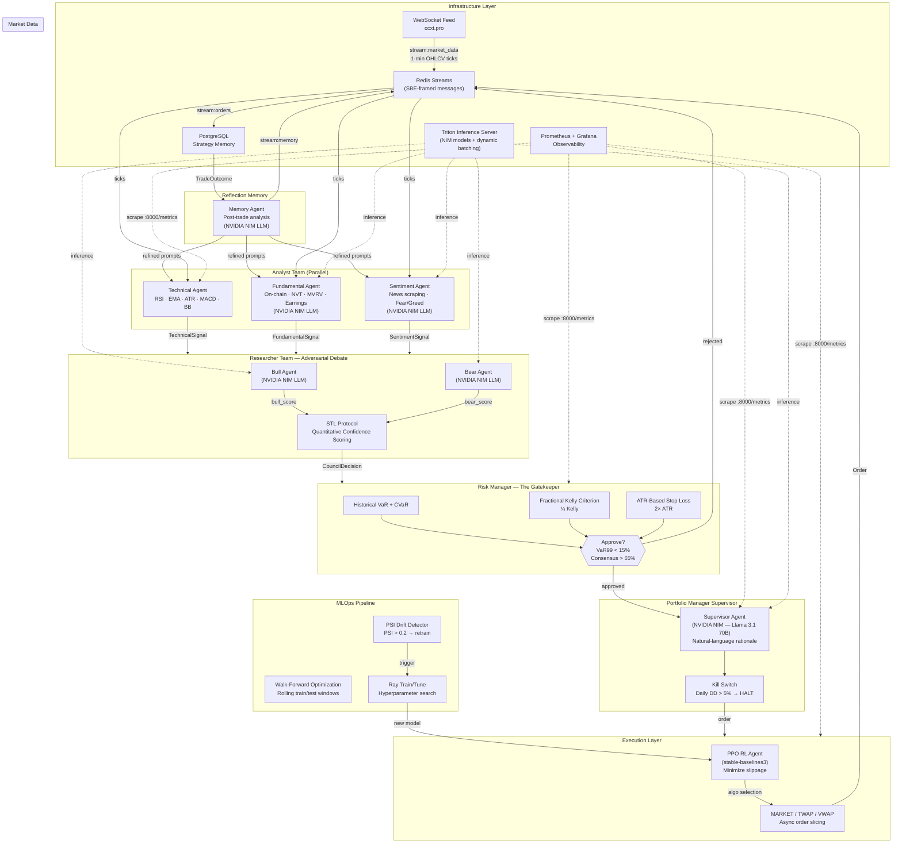

# Quant-Elite: Institutional-Grade Multi-Agent AI Trading System

Powered by **NVIDIA NIM** · **LangGraph** · **PPO (DRL)** · **Redis Streams** · **PostgreSQL** · **Triton Inference Server**

---

## Architecture — Multi-Agent Graph



---

## Production Directory Structure

```
Trade_agent/
├── main.py                    # uvloop entry point + graceful shutdown
├── Dockerfile
├── docker-compose.yml         # Full stack: bot, redis, postgres, triton, prometheus, grafana
├── requirements.txt
├── pyproject.toml
├── .env.example
│
├── core/                      # Shared infrastructure
│   ├── config.py              # pydantic-settings — all env vars
│   ├── models.py              # Canonical Pydantic data models
│   ├── nim_client.py          # NVIDIA NIM async client (OpenAI-compatible)
│   ├── messaging.py           # Redis Streams + SBE framing
│   ├── market_data.py         # WebSocket feed (ccxt.pro)
│   ├── kill_switch.py         # Hard circuit breaker (DD > 5%)
│   └── observability.py       # Prometheus metrics registry
│
├── agents/                    # Specialized agents
│   ├── technical.py           # RSI, EMA, ATR, MACD, Bollinger Bands
│   ├── fundamental.py         # On-chain + earnings (NIM)
│   ├── sentiment.py           # News/social sentiment (NIM)
│   ├── council.py             # Bull/Bear debate + STL Protocol (NIM)
│   ├── risk_engine.py         # VaR, CVaR, Fractional Kelly, ATR stops
│   ├── execution.py           # PPO RL agent + TWAP/VWAP fallback
│   ├── memory_agent.py        # Post-trade reflection → PostgreSQL (NIM)
│   └── supervisor.py          # LangGraph StateGraph orchestration
│
├── mlops/                     # Self-improvement pipeline
│   ├── drift_detector.py      # PSI-based model drift (threshold 0.2)
│   ├── walk_forward.py        # Rolling WFO with Sharpe optimization
│   └── retraining.py          # Ray Train/Tune PPO retraining
│
├── db/
│   └── migrations/
│       └── init.sql           # PostgreSQL schema
│
├── infra/
│   ├── prometheus/
│   │   ├── prometheus.yml
│   │   └── alerts.yml         # Kill-switch, drawdown, drift alerts
│   ├── grafana/
│   │   └── dashboards/
│   │       └── trading.json   # Real-time PnL + latency dashboard
│   └── triton/
│       └── model_repository/  # Triton model configs
│
└── tests/
    ├── test_risk_engine.py    # VaR + Kelly unit tests
    ├── test_council.py        # STL Protocol + debate logic
    ├── test_execution.py      # PPO + paper trading
    └── test_drift_detector.py # PSI calculations
```

---

## Quick Start

```bash
# 1. Copy and configure environment
cp .env.example .env
# Edit .env — set NIM_API_KEY=nvapi-xxxx

# 2. Launch full stack
docker compose up -d

# 3. Access dashboards
#    Grafana:    http://localhost:3000  (admin/admin)
#    Prometheus: http://localhost:9090
#    Metrics:    http://localhost:8000/metrics
```

---

## Key Design Decisions

| Concern | Solution |
|---|---|
| LLM inference | **NVIDIA NIM** (OpenAI-compatible, `integrate.api.nvidia.com/v1`) |
| Orchestration | **LangGraph StateGraph** — deterministic fan-out/fan-in |
| Messaging | **Redis Streams** with **SBE**-framed 8-byte headers (zero-copy) |
| Async runtime | **uvloop** + `asyncio` throughout |
| Consensus gate | STL Protocol → council must score ≥ 0.65 or order blocked |
| Position sizing | **¼ Kelly Criterion** — never bet the full Kelly |
| Stop-loss | **2× ATR** dynamic stops — adapts to current volatility regime |
| Circuit breaker | Hard **Kill Switch** at 5% daily drawdown — auto-broadcast halt |
| Self-learning | Memory Agent → NIM post-mortem → refined analyst prompts |
| Model drift | **PSI > 0.2** triggers **Ray Tune** PPO retraining pipeline |
| Observability | Prometheus + Grafana — latency, drawdown, VaR, slippage, PSI |

---

## Risk Controls (Capital Preservation Stack)

```
1. Technical Filter      → Requires trend + confidence > threshold
2. Council Consensus     → Bull/Bear must agree (consensus ≥ 0.65)
3. VaR Gate              → Historical VaR99 must be < 15%
4. Kelly Sizing          → Position ≤ min(¼ Kelly, 10% of equity)
5. ATR Stop-Loss         → Hard stop at 2× ATR from entry
6. Daily Kill Switch     → All trading halts at 5% daily drawdown
```

---

## NVIDIA NIM Models Used

| Agent | NIM Model |
|---|---|
| Fundamental, Sentiment, Council, Memory | `meta/llama-3.1-70b-instruct` |
| Supervisor rationale | `meta/llama-3.1-70b-instruct` |
| Semantic embeddings | `nvidia/nv-embedqa-e5-v5` |
| Price/risk inference | Triton (custom ONNX models) |

Set `NIM_MODEL` in `.env` to switch to any NIM-hosted model (e.g., `mistralai/mistral-large-2-instruct`).
