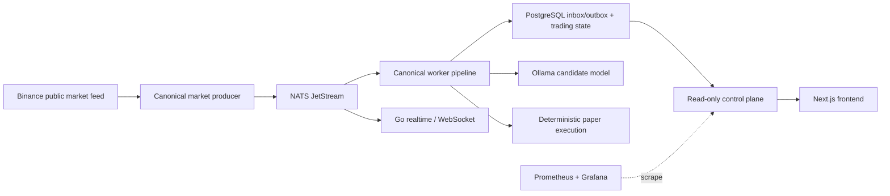
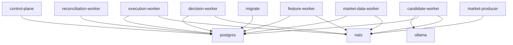
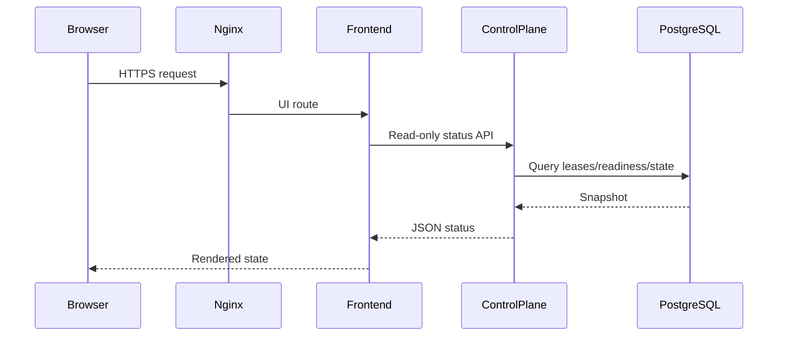
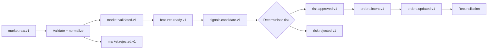
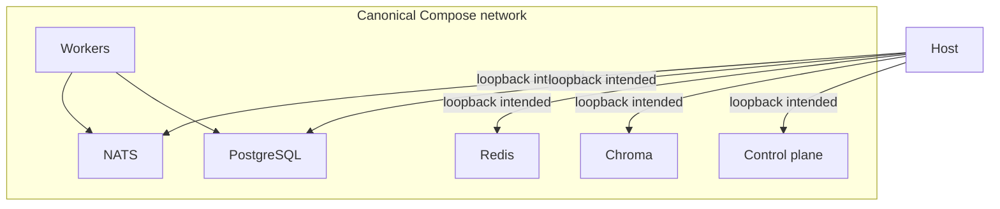
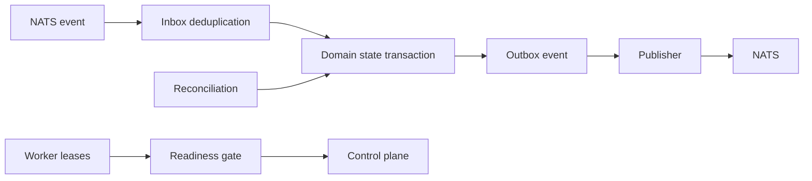
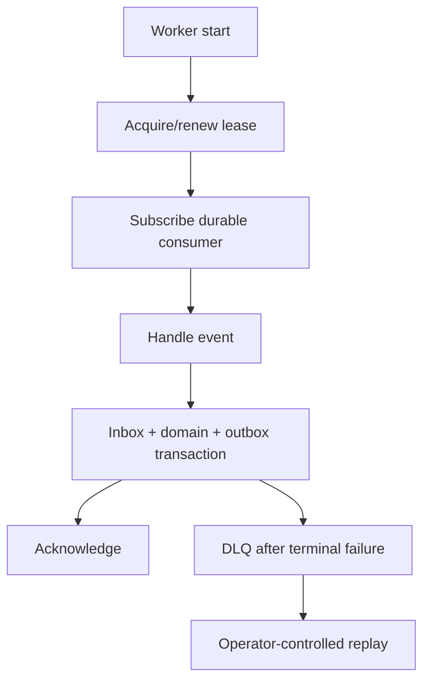
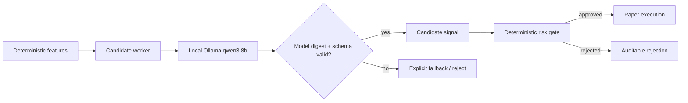
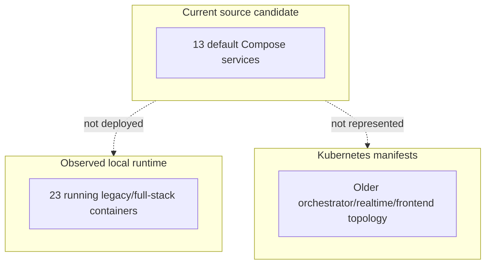
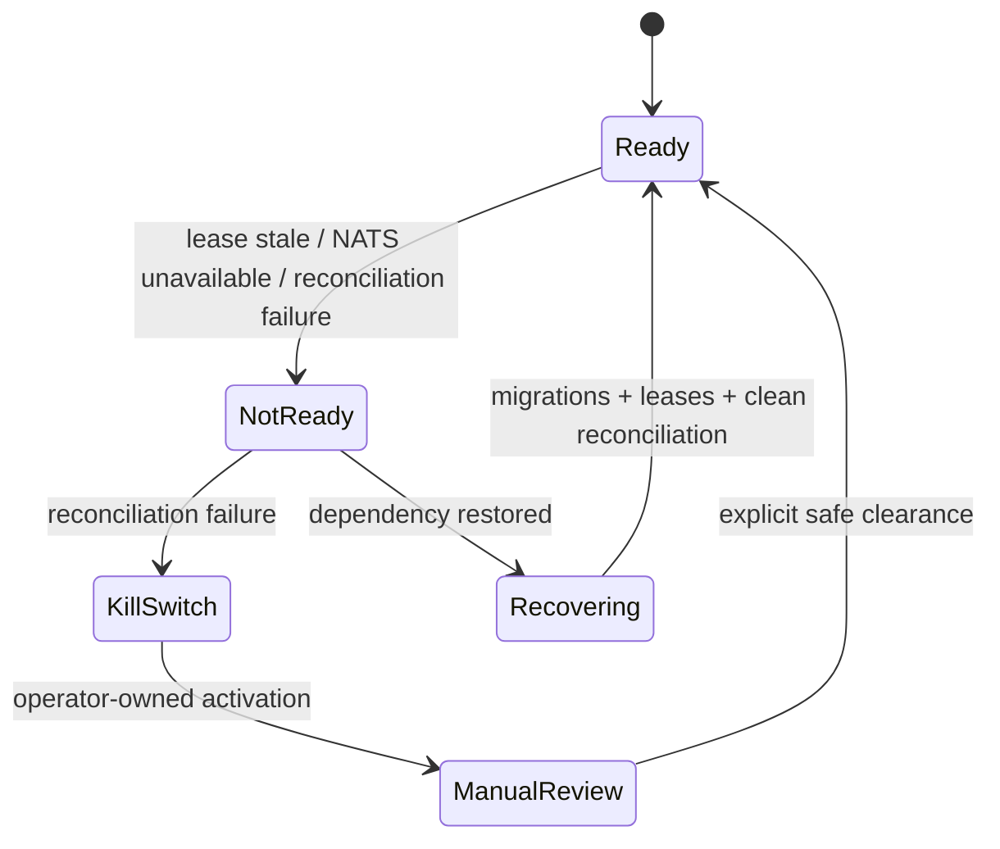

# Architecture

## Reverse-engineered architecture

The intended system is an event-driven modular platform. The canonical path is a
set of deterministic Python workers connected through versioned NATS subjects and
PostgreSQL inbox/outbox tables. Local Ollama produces candidate analysis; a
deterministic risk worker is authoritative; execution is paper-only; reconciliation
and leases govern readiness. The observed runtime was instead a legacy
microservice/full-stack deployment.

There is no dedicated authentication service. The canonical control plane is
read-only, but the running legacy orchestrator exposes mutation routes without an
OpenAPI security scheme.

## 1. High-level system architecture

## 2. Service dependency diagram

## 3. Runtime request flow

## 4. Data flow diagram

## 5. Docker network diagram

Observed legacy containers published many ports on all interfaces rather than the
loopback-oriented canonical defaults.

## 6. Database interaction diagram

## 7. Background job flow

## 8. AI/agent workflow

The model is advisory. Risk and execution must remain deterministic.

## 9. Deployment topology

## 10. Failure and recovery flow

The committed acceptance artifact verifies NATS-driven NotReady and recovery, but
it does not generate a risk decision, order intent, or fill.

## Architecture conclusions

- Style: event-driven modular platform with legacy microservices coexisting.
- Scheduler/cron: no verified production scheduler; workers are long-running loops.
- WebSocket: Go realtime and legacy paths exist; no live signal delivery observed.
- Logging: container stdout/json-file; no bounded rotation.
- Alerting: configuration exists but production delivery was not verified.
- Backup/recovery: no operational backup or restore mechanism verified.
- Primary architecture risk: source/runtime/deployment topology drift.

