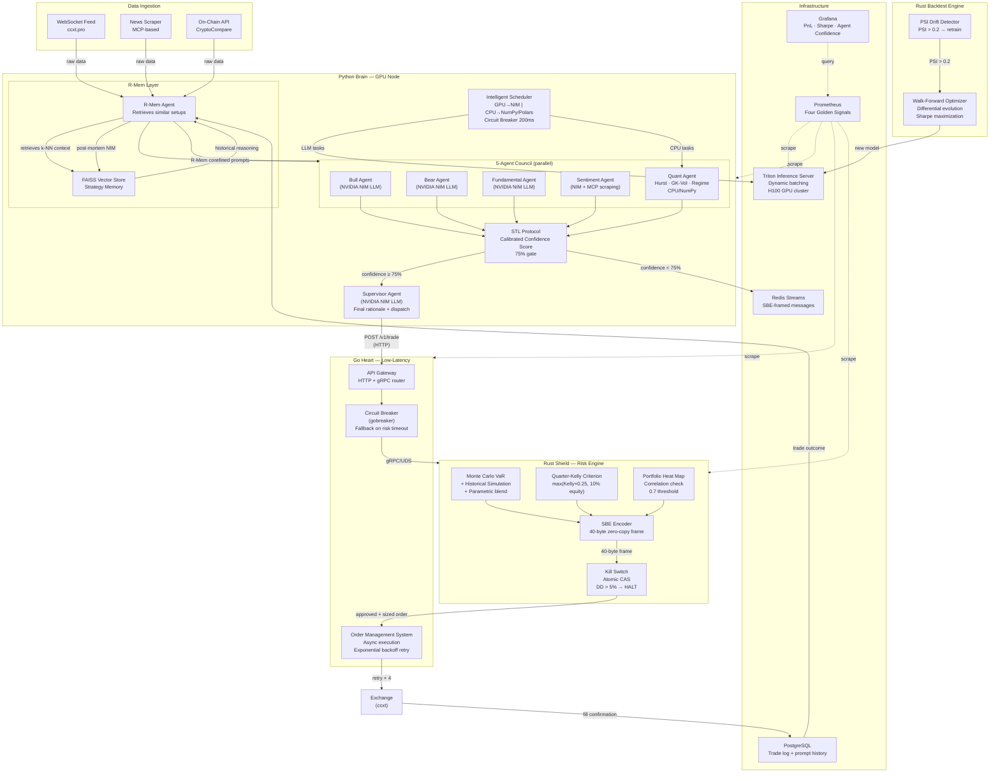

# Sentinel-X: Institutional-Grade Multi-Agent AI Trading Fund

**Tri-language architecture** — Python brain · Go heart · Rust shield  
**NVIDIA NIM + Triton** · **LangGraph** · **gRPC/UDS** · **SBE** · **FAISS R-Mem** · **H100 K8s cluster**

---

## System Architecture — Mermaid Diagram



---

## Project Structure

```
sentinel-x/
├── proto/                          # Language-neutral gRPC definitions
│   ├── risk.proto                  # Rust ↔ Go: VaR + Kelly + SBE
│   ├── orders.proto                # Go ↔ Exchange: OMS order lifecycle
│   └── agents.proto                # Python ↔ Go: council decisions
│
├── python/                         # The Brain (GPU, LLM, ML)
│   ├── core/
│   │   ├── nim_client.py           # NVIDIA NIM async OpenAI-compatible client
│   │   └── scheduler.py            # GPU/CPU router + 200ms circuit breaker
│   ├── agents/
│   │   └── quant.py                # Hurst, GK-Vol, regime detection
│   ├── council/
│   │   ├── supervisor.py           # LangGraph StateGraph with R-Mem
│   │   └── stl_protocol.py         # 5-agent STL calibration + 75% gate
│   └── memory/
│       ├── vector_store.py         # FAISS strategy memory (1024-dim)
│       └── r_mem.py                # R-Mem: retrieval + prompt engineering
│
├── go/                             # The Heart (low-latency routing)
│   ├── cmd/sentinel/main.go        # Service entry point
│   └── internal/
│       ├── gateway/gateway.go      # HTTP API gateway (confidence gate)
│       └── oms/executor.go         # Async OMS + circuit breaker + retry
│
├── rust/                           # The Shield (risk, backtest, SBE)
│   └── src/
│       ├── risk/
│       │   ├── var.rs              # Historical + MC + Parametric VaR blend
│       │   ├── kelly.rs            # Quarter-Kelly + ATR stops (unit tested)
│       │   ├── correlation.rs      # Pearson + portfolio heat map
│       │   ├── kill_switch.rs      # Atomic CAS kill switch
│       │   └── engine.rs           # gRPC service — wires everything
│       ├── sbe/encoder.rs          # 40-byte zero-copy SBE frame
│       └── backtest/engine.rs      # ATR-breakout WFO backtest
│
└── infra/
    ├── k8s/
    │   ├── deployment.yaml         # Python/Go/Rust/Triton deployments
    │   └── gpu-node-pool.yaml      # H100 node pool + NVIDIA device plugin
    ├── docker/
    │   ├── Dockerfile.python       # CUDA 12.4 base
    │   ├── Dockerfile.go           # Distroless runtime
    │   └── Dockerfile.rust         # release LTO build
    └── prometheus/                 # Four Golden Signals config
```

---

## Trade Flow Walkthrough: News Flash → Filled Order

```
T+0ms    News flash: "Fed raises rates 50bps unexpectedly"
         ↓ MCP news scraper captures headline

T+5ms    R-Mem queries FAISS for k=5 similar historical setups
         → finds 3 past "surprise rate hike" setups (2 losses, 1 win)
         → synthesizes: "Rate shocks historically trigger 2-4hr BTC sell-off"

T+10ms   Intelligent Scheduler fans out to 5 agents in parallel:
         • Bull  (GPU/NIM):   Looks for accumulation signals, DCA opportunity
         • Bear  (GPU/NIM):   Rate-shock = risk-off, leverage unwinding imminent
         • Fundamental (GPU): on_chain_score=-0.3, MVRV=3.2 (historically risky)
         • Sentiment (GPU):   news=-0.8, social=-0.7, fear_greed=28 (fear)
         • Quant (CPU/NumPy): Hurst=0.48 (near random walk), regime=HIGH_VOL
                              → tradeable=False (crisis conditions)

T+35ms   STL Protocol aggregates all 5 arguments:
         → Quant says not tradeable → caps confidence at 60%
         → 3 contradictions between Bull supporting factors and Sentiment
         → confidence_pct = 58% < 75% threshold
         → BLOCKED: "Insufficient consensus: high volatility + rate shock"

T+36ms   Trade logged to PostgreSQL as BLOCKED
         R-Mem records reasoning chain in FAISS for future retrieval
         Prometheus counter: council_blocks_total++ (symbol="BTC/USDT")

------  [Alternative scenario: normal trending market] ------

T+10ms   Bull: EMA crossover + volume 1.8× avg + RSI=52 (not overbought)
         Bear: Near 6-month resistance → quantitative_score=0.35 (weak)
         Quant: Hurst=0.63 (trending), regime=LOW_VOL, tradeable=True, adj=+0.08
         Sentiment: news=+0.4, social=+0.3, fear_greed=62 (greed)

T+35ms   STL Protocol: bull_score=0.72, bear_score=0.28
         → 1 contradiction (-5%), no shallow reasoning
         → confidence_pct = 81% ≥ 75% ✓ APPROVED

T+36ms   Supervisor (NIM) generates rationale:
         "BTC/USDT presents a trending setup (Hurst=0.63) with EMA crossover
          confirmed by 1.8× volume expansion. VaR99=2.1% allows ¼ Kelly sizing
          of $8,750 (8.75% equity). Primary risk: 6-month resistance at $67,200."

T+37ms   Python POSTs to Go Gateway: POST /v1/trade
         Go Gateway checks confidence_pct=81% ≥ 75% ✓

T+38ms   Go OMS calls Rust Risk Engine via gRPC over Unix Domain Socket:
         → Monte Carlo VaR99=2.1% (100K paths, 1-day holding)
         → ¼ Kelly = 0.0875 → $8,750 size (capped at 10% equity)
         → ATR stop = $64,200 (2 × ATR below entry)
         → Portfolio heat = 0.42 (BTC+ETH correlation < 0.7 threshold) ✓
         → SBE-encoded 40-byte snapshot for audit

T+42ms   Rust Kill Switch: daily drawdown = 0.8% < 5% threshold ✓
         Risk APPROVED — response returns in 4ms via UDS

T+43ms   OMS dispatches TWAP order: 5 slices × 0.0308 BTC
         Retry logic: attempt 1 succeeds, slippage = 3.5 bps ✓

T+120ms  Order FILLED @ $65,023 avg (slippage 3.5 bps < 20 bps limit)
         PostgreSQL records trade outcome
         Prometheus: oms_orders_total{side="BUY",status="FILLED"}++
         Grafana: PnL panel updates in real-time
```

---

## Risk Control Stack (7 Layers)

| Layer | Where | Constraint |
|---|---|---|
| Confidence Gate | Python STL | ≥ 75% weighted consensus required |
| Volatility Regime | Python Quant | Crisis/untradeable regime → blocked |
| VaR Gate | Rust | Blended VaR99 (hist+MC+parametric) < 15% |
| Kelly Sizing | Rust | Position ≤ min(¼ Kelly, 10% equity) |
| Correlation Heat | Rust | Portfolio heat score < 0.75 |
| ATR Stop-Loss | Rust | Hard stop 2× ATR from entry |
| Kill Switch | Rust (atomic CAS) | DD > 5% → halt all services |

---

## NVIDIA NIM + Triton Integration

| Component | NIM Model | Backend |
|---|---|---|
| Bull/Bear/Fundamental/Sentiment/Supervisor | `meta/llama-3.1-70b-instruct` | NIM Cloud |
| Embeddings (R-Mem FAISS) | `nvidia/nv-embedqa-e5-v5` | NIM Cloud |
| PPO RL execution | Custom ONNX | Triton (H100) |
| Price prediction | Custom TensorRT | Triton (H100) |

All GPU inference routed through the `scheduler.py` circuit breaker — falls back to lightweight CPU heuristics if latency spikes > 200ms.

---

## IPC Architecture: Zero-Copy UDS + SBE

```
Python ─────── HTTP ──────────────► Go Gateway
                                         │
                                     gRPC/UDS
                                         │
                                         ▼
                                    Rust Risk Engine
                                         │
                                    SBE 40-byte frame
                               [ABCD|01|01|00000020|
                                var_99|kelly|size|heat]
                                         │
                                    Back to Go OMS
                                         │
                                    Order dispatch
```

Unix Domain Sockets eliminate TCP stack overhead (~50μs → ~5μs RTT).
SBE 40-byte frames eliminate JSON parsing for the risk snapshot audit trail.
