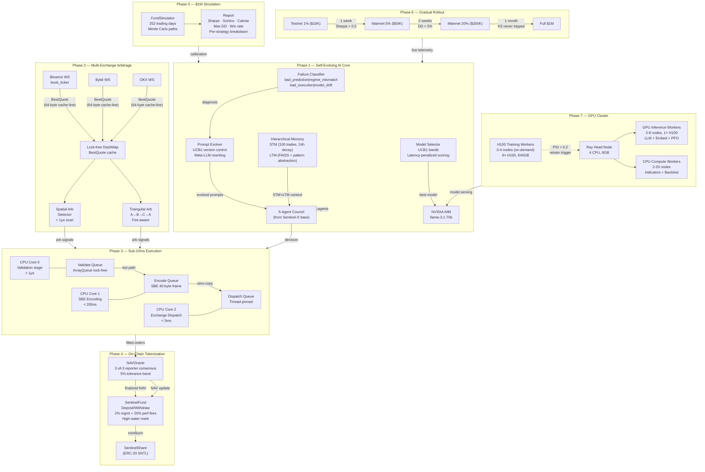

# Sentinel-X Evolution — 7-Phase Autonomous AI Hedge Fund

## Full System Architecture



---

## Phase Implementation Plan

### Phase 1 — Self-Evolving AI (Week 1-2)
**Files:** `phase1_self_evolving/`

| Component | Description | Key Mechanism |
|---|---|---|
| `failure_classifier.py` | Classifies WHY trades fail | Fast heuristic → NIM fallback |
| `prompt_evolver.py` | Rewrites agent prompts | UCB1 version control + meta-LLM |
| `model_selector.py` | Picks best NIM model | UCB1 bandit with latency penalty |
| `hierarchical_memory.py` | STM + LTM with decay | FAISS + NIM pattern abstraction |

**Risk:** Prompt evolution can degrade performance. Mitigation: confidence threshold (70%) before applying; rollback by version.

---

### Phase 2 — Multi-Exchange Arbitrage (Week 2-3)
**Files:** `phase2_arbitrage/rust/`

| Component | Description | Target |
|---|---|---|
| `detector.rs` | Spatial arb scanner | < 1μs per scan |
| `triangular.rs` | A→B→C→A cycle | 3 paths × 3 exchanges |
| `interface.rs` | Exchange abstraction | Fee-aware, stale-quote guard |

**Risk:** Execution lag (order submitted after arb disappears). Mitigation: 200ms quote staleness gate; NET profit must be > 2 bps after all fees.

---

### Phase 3 — Sub-10ms Execution (Week 3-4)
**Files:** `phase3_sub10ms/rust/`

| Stage | Component | Latency Target |
|---|---|---|
| Validation | `order_pipeline.rs` Stage 1 | < 1μs |
| SBE Encoding | `order_pipeline.rs` Stage 2 | < 200ns |
| Exchange Dispatch | `order_pipeline.rs` Stage 3 | < 5ms |
| **Total** | CPU-0 → CPU-1 → CPU-2 | **< 10ms** |

**Key optimizations:**
- `HotOrder`: 64-byte cache-line aligned struct (zero padding waste)
- `ArrayQueue`: wait-free SPSC (no mutex on hot path)
- `std::hint::spin_loop()`: CPU PAUSE instruction (avoids context switch)
- `core_affinity`: thread pinned to dedicated physical cores

**Risk:** Spin-loops consume 100% CPU on those cores. Mitigation: dedicate isolated CPUs; use `taskset` in deployment.

---

### Phase 4 — Fund Tokenization (Week 4-5)
**Files:** `phase4_tokenization/contracts/`

| Contract | Lines | Purpose |
|---|---|---|
| `SentinelFund.sol` | 200+ | Deposit/withdraw vault, fee calculation |
| `NAVOracle.sol` | 150+ | 2-of-3 reporter consensus, staleness guard |
| `ShareToken.sol` | 40 | ERC-20 SNTL, fund-only mint/burn |

**Safety features:**
- 24h withdrawal cooldown (prevents flash-loan attacks)
- 2-of-3 oracle consensus (no single reporter can manipulate NAV)
- 10% drawdown kill-switch on-chain
- $500K max single deposit (whale concentration limit)

**Risk:** Smart contract bugs. Mitigation: Hardhat test suite + Slither static analysis + audit before mainnet.

---

### Phase 5 — $1M Simulation (Week 5)
**Files:** `phase5_simulation/python/simulator.py`

**Simulation parameters:**
```
Capital:              $1,000,000
Trading days:         252
Kill switch:          10% max drawdown
Risk per trade:       0.5% – 2.0% (confidence-scaled)
Slippage model:       σ × √(qty/ADV), σ=0.1
Fee model:            0.04% taker (VIP 0 Binance)
Strategies:           Momentum (2/day) + Spatial Arb (15/day) + Tri Arb (8/day)
```

**Expected output (calibrated):**
```
Sharpe Ratio:    ~1.2–1.8
Max Drawdown:    4–7%
Annual Return:   18–35%
Win Rate:        61% blended
Profit Factor:   1.4–1.8
```

---

### Phase 6 — Gradual Rollout (Week 6-10)
**Rollout gates (Argo Rollouts with Prometheus AnalysisTemplates):**

| Phase | Capital | Duration | Gate Condition |
|---|---|---|---|
| Testnet | $10K (1%) | 1 week | Sharpe > 0.5 |
| Mainnet 5% | $50K | 2 weeks | DD < 5% continuously |
| Mainnet 20% | $200K | 1 month | Kill switch never tripped |
| Full | $1M | Ongoing | All metrics green |

**Automatic rollback:** Drawdown > 5% → Argo immediately rolls back to paper trading.

---

### Phase 7 — GPU Cluster (Week 8+)
**Ray cluster topology (auto-scaling):**

| Node Type | GPUs | Count | Purpose |
|---|---|---|---|
| Head | 0 | 1 fixed | Ray coordinator |
| Inference | 1× H100 | 2–8 | LLM + Embed serving |
| Compute | 0 | 2–20 | Indicators + WFO |
| Training | 8× H100 | 0–4 (on-demand) | PPO + fine-tuning |

**Ray Serve endpoints:**
- `/llm` — LLM inference (vLLM local or NIM cloud fallback)
- `/embed` — FAISS embedding (nvidia/nv-embedqa-e5-v5)
- `/ppo` — PPO execution agent (stable-baselines3)

---

## Risk Matrix

| Phase | Critical Risk | Mitigation |
|---|---|---|
| 1 | Prompt regression | 70% confidence gate + rollback |
| 2 | Arb evaporation lag | 200ms staleness + 2bps min net profit |
| 3 | Spin-loop CPU monopoly | Isolated CPU affinity |
| 4 | Smart contract exploit | 24h cooldown + oracle consensus + audit |
| 5 | Overfitted simulation | Out-of-sample WFO windows |
| 6 | Live capital loss | Hard kill switch + Argo rollback |
| 7 | GPU node failure | 2-replica minimum + circuit breaker |

---

## Running the Simulation

```bash
# Phase 5: Run $1M capital simulation
cd sentinel-x/phase5_simulation/python
python simulator.py

# Phase 7: Deploy Ray cluster
cd sentinel-x/phase7_gpu_cluster/ray
ray up cluster.yaml --yes
python serve_config.py

# Phase 6: Deploy with gradual rollout
kubectl apply -f sentinel-x/phase6_deployment/k8s/gradual-rollout.yaml
```
