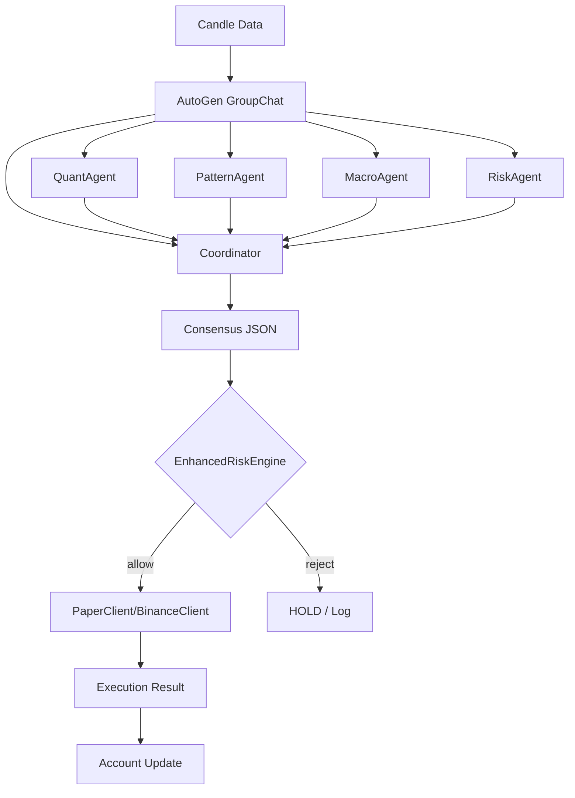

# AutoGen Trading Pipeline

## Flow


## Agent Roles
| Agent | Model | Responsibility |
|-------|-------|----------------|
| QuantAgent | qwen2.5:3b | Technical indicators, RSI, EMA, ATR |
| PatternAgent | moondream | Chart patterns, VLM analysis |
| MacroAgent | qwen2.5:3b | Market regime, macro context |
| RiskAgent | qwen2:1.5b | Hard filter, position limits |
| Coordinator | phi3:mini | Final JSON consensus |

## Message Format
Each agent outputs JSON:
```json
{
  "action": "BUY|SELL|HOLD",
  "confidence": 0.0-1.0,
  "entry_reason": ["reason1", "reason2"],
  "risk": {"approved": true|false, "notes": "..."}
}
```

## Coordinator Output
```json
{
  "action": "BUY",
  "confidence": 0.95,
  "entry_reason": ["Ascending Triangle confirmed", "Low ATR"],
  "risk": {"approved": true, "notes": "Low market ATR..."}
}
```

## Latency Breakdown (typical)
- autogen: 38s (Ollama sequential)
- risk: ~1ms
- exec: ~6ms (paper)
- total: ~38s

## Key Files
- `orchestrator/autogen_team.py` — GroupChat setup
- `orchestrator/autogen_executor.py` — Full pipeline
- `orchestrator/autogen_trader.py` — CLI entry

## Related
- [[Enhanced Risk Engine]]
- [[Model Loader VRAM Strategy]]
- [[CLI Reference]]